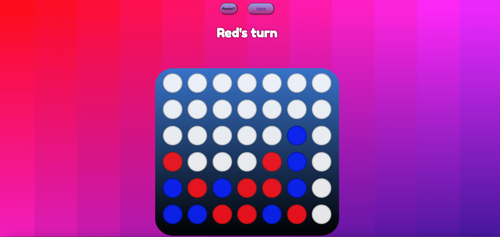

# Connect4!

### Date: 2.12.2021

### By: Jonte' Fears
[Trello](https://trello.com/b/z7YWRiNW/project1) | [LinkedIn](https://www.linkedin.com/in/jonte-fears-a70070156/) | [GitHub](https://github.com/JYoung554)

[Live Site](little-division.surge.sh/)

***

# Technologies Used
* HTML
* CSS
* JavaScript

# Description
This will be a web-based version of the board game Connect Four. In Connect Four , players are designated a disc of one of two colors that are inserted into a column of a 7-by-6 grid. The winner is determined by having a row of 4 of their discs horizontally , vertically, or diagonally.

# Game Flow

- Start Page
- Game Start
- Game Active
- Winner
- Restart

# How to get started
Player must select start button on screen. Game then initializes Player One and Player Two and their colors. Player One makes first move. Moves consist of selecting a cell on the grid for their disc to be dropped into. Both players take turns until a win condition or a draw is met. When one of the conditions is met , a win or draw message is shown along with an option to restart the game.

# Credits

Background : https://www.svgbackgrounds.com/#quantum-gradient

